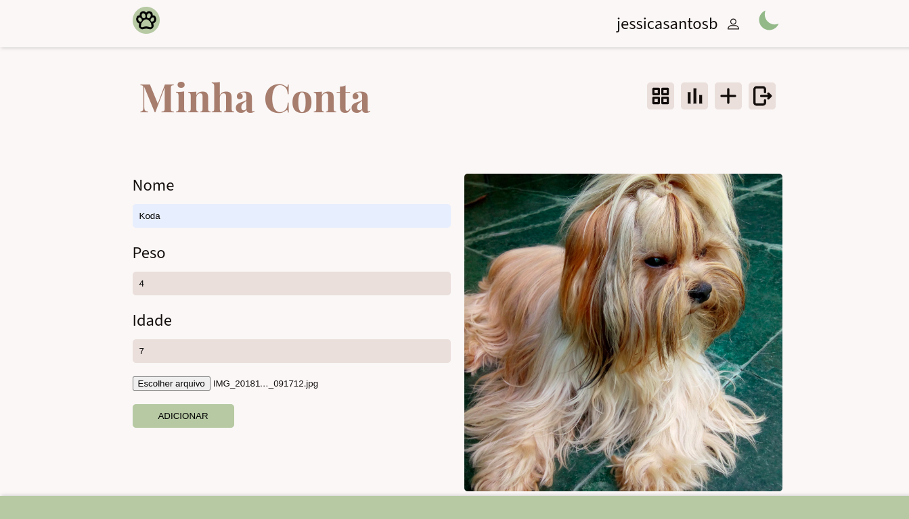

# Dog App

[Português]
Rede social Dogs, uma aplicação desenvolvida em React no curso da plataforma Origamid. Com autenticação utilizando JSON Web Token.

[English]
Dogs social media, It is an application developed in React following Origamid course, featuring JSON Web Token authentication.

## Getting Started
Para começar no Dog App, siga estes passos:

1. Clonar o repositório: **`git clone https://github.com/jessicasantosb/dog-app.git`**
2. Entrar na pasta do projeto: **`cd dog-app`**
3. Instalar as dependências: **`npm i`**
4. Iniciar o aplicativo: **`npm run dev`**

## Live Demo

[Português]
Confira a demonstração ao vivo

[English]
Check out the live demo

[Live Preview](https://dog-app-jessicasantosb.vercel.app/)

## Screenshot

## Technology Stack

- React

## Author

Created by Jessica Bandeira.

- LinkedIn: [Jessica's LinkedIn Profile](https://www.linkedin.com/in/jessica-santosb/)

## Known Issues and Future Improvements

[Português]

- Mencione quaisquer problemas conhecidos ou limitações.
- Esboce seus planos para melhorias futuras.

[English]

- Mention any known issues or limitations.
- Outline your plans for future improvements.